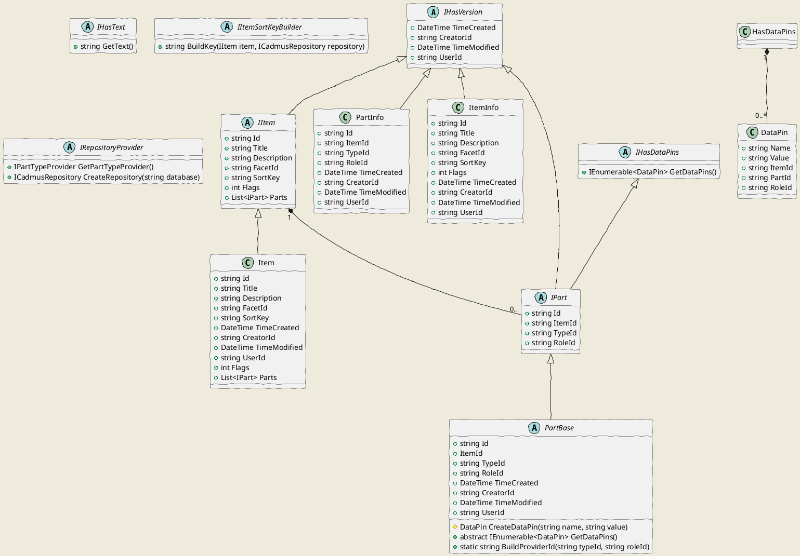
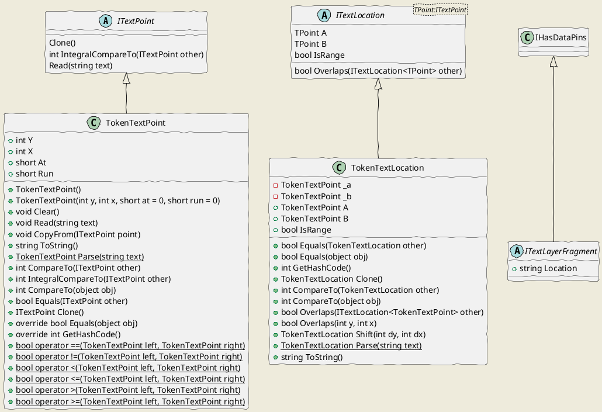
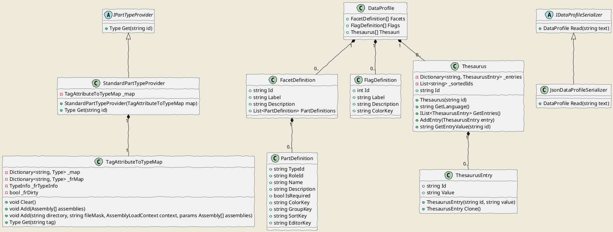
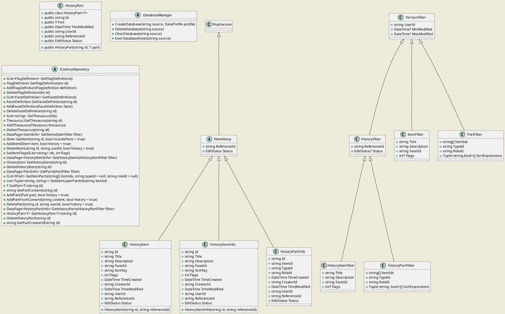

# Cadmus Core

This is the core namespace for the Cadmus system. It includes the following namespaces:

- `config`: components related to the system configuration.
- `layers`: components related to the text layers. These are a type of parts specialized in handling metatextual data, i.e. data strictly connected to a specific portion of a base text.
- `storage`: components related to the underlying storage system. These are all abstractions, virtually independent from any specific storage technology.

## (A) Core



### A.1. General-Purpose Interfaces

A number of interfaces and classes are provided to define the attributes of their implementors.

- `IHasVersion`: implemented by objects stored with "version" information, i.e. created time and creator ID, plus last saved time and user ID. These are used for auditing and editing history.

- `IHasText`: implemented by parts which contain some sort of continuous text (e.g. a note part), which could be used as a document for text-based indexing purposes.

- `IHasDataPins`: implemented by parts exposing data pins. A data pin (`DataPin`) is just a name/value pair derived from an item's part. Most parts expose such pairs to the outer world mainly for indexing purposes. For instance, a datation part might expose a numeric value representing its content. As each part is an independent entity, with its own model, it is only the part which can know which data could be extracted from it for indexing. Thus, typically parts implement this interface. The data pin is generic enough to represent different levels of granularity: it may just be a name/value property, or a more complex entity, e.g. a semantic web triple (usually with name acting as predicate and value as object, the implicit subject being the data pin owner). Note that these pins are not stored, but calculated. The calculation is implemented in the part's own code. Of course, this does not stop us to store the snapshot results of such calculations, either elsewhere or in the same data store, should this be required for publishing purposes.

- `IItemSortKeyBuilder`: used to build the item's sort key from its data. Sort keys are used to display paged (and thus ordered) lists of items in the UI. Implementors of this interface provide their own algorithm to generate a sort key given a specific item (and eventually its parts). The default implementation (`StandardItemSortKeyBuilder`) just relies on the item's title, which is normalized by flattening any whitespace to a single space, trimming the result at both ends, lowercasing all the letters and removing any diacritics from them, and keeping only letters, digits, and apostrophe. In the Cadmus profile you are free to replace this component with any other, should you need a special ordering. Whenever an item is saved, its sort key is automatically rebuilt and stored with it.

- `IRepositoryProvider`: an interface used in consumer code infrastructure to provide implementations of `ICadmusRepository` and `IPartTypeProvider`. These depend on the system's details; for instance, in the API layer they rely on static linking (as the API is targeted to a closed and ready-to-deploy Docker image), whereas in the CLI tool they rely on dynamic linking (a true "plugin" architecture).

### A.2. Tags

Every "pluggable" component, like parts or fragments, is decorated with a `TagAttribute`. This attribute has a single `Tag` value, which must be unique in the Cadmus ecosystem. This value is used to find and instantiate the component type.

To ensure uniqueness, the convention is prefixing the ID with a domain name. Also, you should use just `a-z` lowercase letters or digits, dots, and dashes. For instance, `net.fusisoft.categories` is the ID for the categories part.

### A.3. Data Blocks

The building blocks for the Cadmus data model are **items** and **parts**.

The item and part types are DTO interfaces and classes, essentially used to represent and transfer data between system layers, whatever the underlying data store. They correspond to database entities, at a higher abstraction level.

All the **IDs** for these blocks are client-side generated GUIDs, modeled as strings in the generic entities objects which represent the data at a higher abstraction level.

#### A.3.1. Items

The item is what roughly corresponds to a *record* in the Cadmus database: for instance, in a collection of inscriptions it would be a single inscription; in a collection of archeological artifacts, it would be a single artifact; in a literary text document, it would be a semantically defined division in it (e.g. a poem or a paragraph); etc.

All the items have a single data model. This model is represented by the `IItem` interface. Each item has:

- an **ID**;
- a set of essential **metadata** (like title or last modified time);
- a collection of **parts**, each representing a specialized piece of data, with its own model.

Notice that the item essentially being a data-transfer object, this does not necessarily reflect the underlying storage. In fact, parts are stored independently of items. Yet, at a higher level of abstraction items "contain" parts. According to the API, an `IItem` can have its parts collection filled, or just leave it empty; in both cases, this does not necessarily means that in the database the items has or has not parts; it only represents the subset of data requested by a specific API.

Among its metadata, an item also has a **sort key**, i.e. a string representing its position in a lexicographic order. This order is the default order used when retrieving items for presentation purposes, e.g. when getting a virtual page of items. As such, the sort key is algorithmically defined by an object implementing the `IItemSortKeyBuilder` interface.

Finally, an item can also have a set of 32 **flags** whose meaning is arbitrarily defined (in the Cadmus data profile). These typically serve for specific in-house editing purposes; for instance, they might specify items marked for a revision. The flags are just bits in a 32-bits integer.

#### A.3.2. Parts

The concept of part derives from the fact that *most items share a common subset of data models*. For instance, think of a structured datation, with different levels of granularity, from day, month, and year up to centuries, and different levels of uncertainty, from a point to an interval in time. The model of a similar piece of information would be needed to be fully repeated in each item requiring to be dated, whatever its nature. Also, whenever we want to add the date to an item, we would have to change its model.

Rather, *the items model is composed by its parts*. Items contain a collection of such parts, each representing a specialized data model. This makes the abstract data model of each item totally dynamic, as far as it depends on the parts it contains.

You can think of an item as a black *box*, which can contain whatever *object* you toss into it. These objects are the parts.

This makes it possible not only to reuse data models in the context of a composable record, but also to reuse editing user interfaces in the context of a composable frontend.

A part can represent *any* type of data. If we refer to text, a part can either be *textual* (=a text), *meta-textual* (=a piece of data linked to a specific portion of a text), or *extra-textual* (=a piece of data which has no direct relationship with a text).

A part is thus the atomic data record. Each part has its own model, plus a common shape represented by the `IPart` interface, which defines a set of metadata, like the container **item ID**, the **part type ID** (an arbitrary string which uniquely identifies its type: e.g. `date` for a datation part), and eventually its **role ID**.

The role ID is used only when adding *several parts of the same type* to the same item. This happens in two cases:

- when we need *several parts of the same type*, because of the intrinsic nature of our data. For instance, two date parts may refer to the date of the original text and to that of its later copy. In this case, a role ID helps selecting the desired part from an item. The value of the role ID is an arbitrary string, as defined by content authors. It should be a very short identifier, usually a single word, like e.g. `copy`.
- when we add *text layers*. A text layer (see below under `Layers`) is a collection of data fragments linked to a specific portion of a base text. As such, the text layer is a single part type; but it may contain different types of fragments. Thus, we typically have several layer parts with different roles, one for each type of fragment: e.g. an apparatus layer and a comment layer. The role ID for layer parts always starts with the reserved `fr.` (=fragment) prefix (defined in `PartBase.FR_PREFIX`), to distinguish it from other role ID types.

The interface `IItem` is implemented by `Item`. Given that items are all created equal, as far as they share a common model, a single concrete type is enough to represent any item.

Each part instead has its own model, represented by a specific concrete type, implementing the `IPart` interface. Part implementations usually derive from a `PartBase` abstract class, which provides some common data and functionality.

Guidelines for **implementing a part**:

- *derive* from `PartBase`, even if this is not strictly a requirement, but rather a commodity. The part class must anyway implement the `IPart` interface.
- *decorate* the class with a `TagAttribute` providing the part's type ID.
- *do not add any logic* to the part. The part is just a POCO object modeling the data it represents, and should have no logic. The only piece of logic required is the method returning the part's data pins, which is just a form of reflecting on the part's data themselves, to extract a sort of index from them.
- consider that the part will be subject to automatic serialization and deserialization. As the part is just a POCO object, this should not pose any issue.

Guidelines for **implementing a layer part**: for layer parts, the same guidelines already listed for the other parts are applicable, with the following additions:

- create a `...LayerFragment` class representing the fragment for the layer part. This is the true data model for the metatextual data represented by the layer. The class must implement `ITextLayerFragment`. Do not add any other property to the class; by design, the only property of a layer part is its collection of fragments.
- give the fragment a type ID (via the usual `TagAttribute`) which *must* begin with the prefix `fr.` (note the trailing dot).
- if adding pins in the fragment, just provide the pin's name and value; the other properties will be supplied by the container part. By convention, you should prefix your pin name with the `fr.` prefix.

#### A.3.3. Summary Data

Typically, the database can be queried for a single item or part, or for a set of summary information about items or parts matching some specific criteria (filters). This is the well-known "list-and-details" scenario, where the UI provides a filtered list of objects, among which users pick a single object for editing or viewing its details.

The summary information for items and parts used when browsing them is represented by classes `ItemInfo` and `PartInfo`, respectively. Currently, they represent only the essential metadata from each object.

## (B) Layers

The *layers* namespace contains components related to the text layers. Text layers are collections of metadata, all connected to a base text, just like all the pages of a book are connected to its spine.



### B.1. Layer Parts

A part can represent any type of data. In the case of text, usually there is a base text, and any number of metatextual structures attached to it.

Think for instance of a traditional markup document like TEI, where ideally the text is just a plain text, and we then add XML tags to encode all these structures.

In Cadmus, this scenario is rather represented in terms of parts, as for any other type of data:

- the base text is a text part, including only plain text (e.g. the text of an inscription, just as it appears on the stone);
- then, any set of metatextual data is represented by a different part, like e.g. abbreviations part, paleographic description part, apparatus part, chronological part, geographical part, prosopographical part, etc.

You can imagine all these metadata as **layers** which get overlaid on the base text, just as in photo-editing tools you have the original picture in its base layer, and add any modification by adding new layers to it. This makes it possible to have a composable editing procedure, where the original picture is never touched, and yet we can add as many layers as we want to modify it at will.

In this metaphor, the original picture is the base text, while the layers are the parts which refer their data to any portion of it. So, all what we have here is a set of parts: one representing a text, and others representing layers.

In XML your metadata is embedded in the text as markup, and modeled after a DOM, i.e. practically into elements and attributes; in Cadmus metadata are just parts, each modeled as an independent object.

So, from a general standpoint, text layer parts are just parts. The only distinguishing feature is that their model is constant, and consists of a collection of **part fragments**.

### B.2. Part Fragments

A part fragment is an object whose class implements the `ITextLayerFragment` interface. This states that the fragment can have data pins (the interface extends `IHasDataPins`), and has a specific location inside its target text. The location is represented as a string, whatever its type.

A text location, even if serialized as a string, can be represented for manipulation purposes by a more structured object. This implements the `ITextLocation` interface, which in turn contains one or two text location points, implementing the `ITextPoint` interface.

The default implementation for text location is *token-based* (where *token* = any sequence of characters delimited by whitespaces), and thus represented by `TokenTextPoint` and `TokenTextLocation`. In token-based location, each text portion is addressed by a set of 2 or 4 coordinates:

- **Y** represents the unit number, e.g. a line in an inscription.
- **X** represents the token number inside the unit. A token is just any part of text surrounded by whitespace.

Thus, in an inscription `Y=3 X=2` addresses the second token (usually "word") of the third line.

Additionally, we can add these other two coordinates:

- **at**: the ordinal number of the first character to be addressed inside a token.
- **run**: the number of characters to include from the first one.

For instance, when mapping a translation we might require to map the token `and` in `and he` from Latin `isque` to just the last 3 characters (`que`) of the unique token `isque`. In this case, we can set `at`=3 and `run`=3.

This coordinates system has the advantage of being very simple, yet both machine- and human- readable.

## (C) Configuration

This namespace contains configuration-specific components, used to define the Cadmus data model and provide additional resources.



A Cadmus database has a data profile defined by three main components:

- items **facets** definitions: there must be at least 1 facet. Each facet is a set of parts definitions, and lists all the parts which can appear in an item of a given "type".
- items **flags** definitions: the optional 32 flags assignable to each item are defined here.
- **thesauri**: a set of taxonomies, flat and/or hierarchical, used to provide closed sets of predefined values to the user.

This profile can be defined in a text file. An `IDataProfileSerializer` implementation is used to deserialize the profile from its format; its JSON implementation is `JsonDataProfileSerializer`.

### C.1. Item Facets

Items have a dynamic model, defined by the parts they contain.

Each part has its own definition (`PartDefinition`), which includes a set of metadata essentially used for presentational or editing purposes.

The **part definition** includes:

- part *type ID* and (optional) *role ID*;
- a human readable *name* and *description*;
- a flag specifying whether the part is *required*;
- further presentational aspects: a *color key*, a *group key*, a *sort key*, and an *editor key*. These are used to present parts with different colors, group them, and sort them in a UI.

Note: the **editor key** can be used to group parts according to the frontend editors organization. Whereas `GroupKey` is a purely presentational feature, `EditorKey` is related to how the frontend organizes its editing components in different modules.

For instance, the same frontend module might include two parts whose definitions have different `GroupKey`'s, so that they get displayed in different groups, but their editors are found in the same component. This is a property used by frontend only, and has no usage in the database or in the backend.

A set of parts definitions determines an item's facet, defined for presentational and validation purposes during editing. A **facet definition** (`FacetDefinition`) has a number of fixed metadata (ID, label, description), and a collection of part definitions.

### C.2. Flag Definitions

The meaning of each item's flag can be defined using `FlagDefinition`'s.

A flag being just a bit, the definition simply links its numeric value with a label and a description, plus a color key.

### C.3. Thesauri

Often, a common requirement for data is having some shared terminology and taxonomies to be used for the whole content. For instance, think of a collection of inscriptions a typical requirement would be a set of categories, which are traditionally used to group them according to their type (e.g. funerary, votive, honorary, etc.). In fact, there are a number of such sets of tags, which vary according to the content being handled categories, languages, metres, etc.

In such cases, usually we also want our editing UI to provide these entries as a closed set of lookup values, so that users can pick them from a list, rather than typing them (which would be more difficult, and error-prone).

Cadmus provides a generic solution to these scenarios in the form of **thesauri**, each including any number of entries.

A **thesaurus entry** (`ThesaurusEntry`) is a generic id/value pair used by some parts or fragments to represent a set of selectable options.

Note that each thesaurus has its own language, so that you can provide the same entries in different languages. If the client requests an undefined language, the system falls back to the default language, which is English (`en`).

### C.4. Part Providers

Some helper components are implemented to provide a better experience in using and adding parts and fragments.

The `PartProvider` interface defines a service which can be used to instantiate any part or part fragment object from its type ID, as defined in its `TagAttribute` value. The service can then be used to materialize the part (or part fragment) data into structured objects, each with its own type.

The type ID is a simple arbitrary string, which should be unique across the system. It is not directly the class name, to provide a further level of abstraction and frendlier IDs. This ensures a more maintenable system, and does not tie it to the underpinnings of a specific implementation; also, IDs are less verbose, and more human-friendly.

A type ID, used for parts and part fragments, should include only letters `a-z`, digits, dashes and dots.

Dashes are used to represent spaces, while dots define a naming hierarchy.

As a convention, an ID should be modeled after a reversed URI domain, and prefixed with `fr.` in the case of part fragments. For instance, a note part ID might be `net.fusisoft.note`, and a comment layer fragment ID might be `fr.net.fusisoft.comment`.

These IDs are used in configuration profiles to define the parts and fragments types used in a Cadmus database.

The standard implementation of the part provider (`StandardPartProvider`) uses an implementation of `TagAttributeToTypeMap`, which defines a map between the type ID of each part/fragment to a C# class `Type`; thanks to this map, it is able to instantiate it from its ID.

This mapping can be provided from statically linking the desired parts/fragments, or by dynamically linking them (via reflection, by scanning a set of plugin assemblies). These different approaches are fit to different environments: the API layer uses static linking, as it is targeted to a Docker image, while the CLI tool uses dynamic linking.

#### Note on Part Instantiation

In this discussion, for brevity I use the term *type ID* for the value of the attribute (in C#) decorating the corresponding part or fragment class, and the term *class type* for the C# class types.

The type ID is provided by the `TagAttribute` attribute.

The provider is represented by an `IPartTypeProvider` interface, which returns a class `Type` from a given type ID. In turn, the returned `Type` will be used to instantiate the part, either when deserializing it from its JSON representation (the part content as stored in the database), or when creating a new part object.

The standard implementation of this interface, `StandardPartTypeProvider`, is a simple wrapper around a `TagAttributeToTypeMap`. This represents a set of mappings between attributes of type `TagAttribute` and the types they decorate. The mappings are built via reflection from a set of preloaded assemblies, and/or by loading assemblies from a specified directory.

In this map, for those classes implementing `ITextLayerFragment` (and decorated with the `TagAttribute`), a mapping is inferred by combining the generic layer part `TokenTextLayerPartTFragment` with each of these fragment classes. This way, we have a mapping for all the closed generic types representing the various text layers.

In this case, in the map the type ID results by combining the part's type ID with the fragment's type ID, as follows:

1. part type ID (e.g. `net.fusisoft.token-text-layer`, decorating the part representing a text layer using token-based text coordinates);
2. colon (`:`);
3. part role ID, which for text layer parts is equal to the fragment's type ID (e.g. `fr.net.fusisoft.comment`), optionally followed by a role for the layer part, prefixed by colon.

For instance, `net.fusisoft.token-text-layerfr.net.fusisoft.comment` is the inferred type ID for a fragment with type ID `fr.net.fusisoft.comment`, combined with a layer part with type ID `net.fusisoft.token-text-layer`.

Should this layer part have a role, this appears at the end of the type ID, e.g. `net.fusisoft.token-text-layer:fr.net.fusisoft.comment:scholarly` for scholarly comments.

An apposite function in `PartBase`, `BuildProviderId`, is used to build the type ID to instantiate a part via a part provider, given a specified part type ID and role ID.

The result of this function is either equal to the part's type ID (e.g. `net.fusisoft.note`), or, for a layer part, equal to the part's type ID + `:` + the fragment's type ID (e.g. `net.fusisoft.token-text-layer:fr.net.fusisoft.comment`).

The convention underlying this method assumes that any fragment type ID starts with the `fr.` prefix (defined as a constant in `PartBase`), and that a layer part has the fragment type ID as its role ID.

For instance, a token-based text layer part for comments has type ID=`net.fusisoft.token-text-layer`, and role ID=`fr.net.fusisoft.comment`.
So, each layer part has the corresponding fragment ID as its role. Should we want to use the same fragment type with different roles, we add a new part type definition with role=fragment ID + colon + role ID, e.g. `fr.net.fusisoft.commentscholarly`.

A couple of unit tests should make this discussion more concrete

```cs
[Fact]
public void Get_NotePart_Ok()
{
    Type t = GetProvider().Get("net.fusisoft.note");

    Assert.Equal(typeof(NotePart), t);
}

[Fact]
public void Get_CommentLayerPart_Ok()
{
    Type t = GetProvider().Get(
        "net.fusisoft.token-text-layer:fr.net.fusisoft.comment");

    Assert.Equal(typeof(TokenTextLayerPart<CommentLayerFragment>), t);
}
```

As you can see, when requesting a comment layer part we get a closed generic type, combining the generic token-based text layer part (`TokenTextLayerPart<T>`) with the comment layer fragment (`CommentLayerFragment`).

For instance, the MongoDB repository instantiates parts from a JSON text representing them (`content`) like this

```cs
private IPart InstantiatePart(string typeId, string roleId, string content)
{
    string reqTypeId = PartBase.BuildProviderId(typeId, roleId);
    Type type = _partTypeProvider.Get(reqTypeId);
    if (type == null) return null;

    return (IPart)JsonSerializer.Deserialize(content, type, _jsonOptions);
}
```

In this function, the requested type ID is built via `PartBase.BuildProviderId` from the part's type ID and role ID. Then, the type provider is used to get the `Type` for that ID. Finally, the JSON text representing the stored part is deserialized into that `Type`.

As the part provider works also for closed generic types representing text layer parts, this allows to create a single class representing a text layer part, and reuse it with whatever type of fragment. You just need a single class for each text layer coordinates system; in our case, this is the `TokenTextLayerPart<T>` class, based on token-related coordinates.

## (D) Storage



The *storage* namespace contains the components used to work with the underlying storage, like:

- **filters** for browsing items and parts (`ItemFilter`, `PartFilter`, `VersionFilter`, `HistoryItemFilter`, `HistoryPartFilter`);
- objects representing the **editing history** (`HistoryItem`, `HistoryPart`, `HistoryItemInfo`, `HistoryPartInfo`);
- a **database management** interface (`IDatabaseManager`), used to represent an admin service to create and delete databases, mainly used for testing purposes;
- a **repository** (`ICadmusRepository`), which connects any consumer code from upper layers to the lower data storage layer. The repository is the only access to data in the whole system. The implementation of this storage is found in separate packages, each related to a specific technology (e.g. MongoDB).

### History

Whenever writing data to the underlying data store, a full editing history can be activated.

As any access to the data store is mediated by the repository, any of its methods affecting the underlying data in a way which should be recorded in editing history gets a boolean `history` parameter. When this is `true`, history data will be saved.

The methods affecting history are related only to items and parts. All what refers to the database profile is excluded as configuration-related operations.

As for items and parts, creating, updating, or deleting them affects history. The only update operation which by design does not affect history is setting the flags of one or more items. This is because flags are essentially a redactional device, used to "mark" a set of items for some purpose (e.g. flag them to be revised).

Thus, there are only 4 repository methods affecting history:

- `AddItem`: adds or updates an item (not its parts).
- `DeleteItem`: deletes an item with all its parts.
- `AddPart`: adds or updates a part.
- `DeletePart`: deletes a part.

History records are just wrappers, which include a copy of the original record, plus some additional data, i.e.:

- the history record ID.
- the ID referring to the original record (reference ID).
- status: the new status of the original record: either "created", "updated", or "deleted".
- date and time of modification.
- ID of user who modified the record.
- date and time of creation.
- ID of user who created the record.

For instance, when editing items with history, this is what happens:

- if an item with the same ID *does not exist*, a new history record is added with status=created, and user ID and modification time taken from the item being stored. This way, the time refers to the creation time, and it is equal to that of the stored item. Note that this allows client code to set the items creation time, which is usually required in some scenarios, e.g. when importing a set of items in a batch. When just editing single items, the client code sets the creation time to the current time (which implicitly happens by default when creating an object with a version).

- if an item with the same ID *exists*, a new history record is added with status=updated, and user ID taken from the item being stored. The modification time instead gets automatically updated to the current time, both in the received item before storing it, and in the history item. This ensures the modification time to be correct, and reflect the actual time of the operation.

- when an item is *deleted*, a new history record is added with status=deleted, user ID received from client code, and modification time equal to the current time. This is the only case where the modification time of the operation is not in synch with that of the original record, as once deleted the original record will no more exist. Thus, deleting has the effect of creating a last, additional history record which stores the last data for the deleted record and registers its deletion. Once deleted, to get the ID of the user who edited/created the original record, and its creation or modification time, you just have to look one step behind in history: there, you will find the history record with status equal to updated or created.
