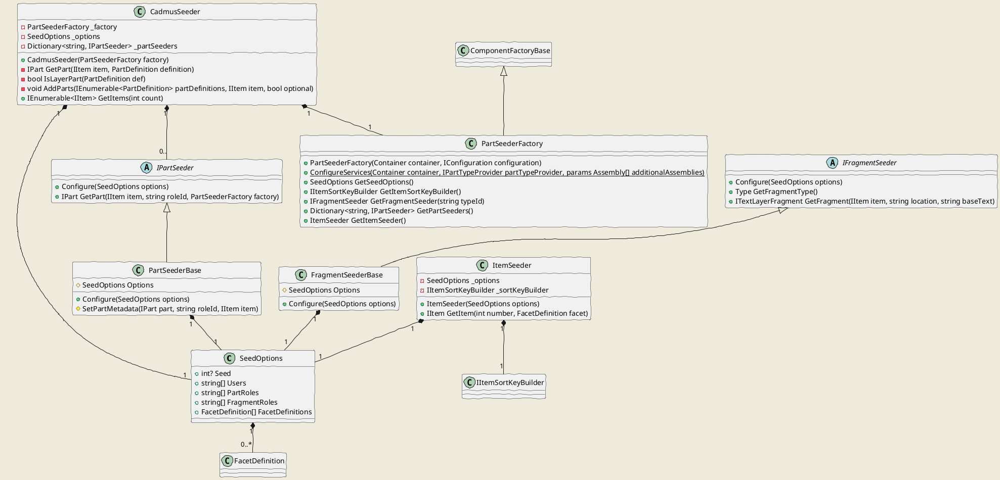

# Seeding

Cadmus provides an infrastructure for seeding a database with fake data.

The core assembly for the infrastructure is `Cadmus.Seed`; then, each part/fragments assembly can have a corresponding seed assembly, conventionally named after it by adding a `.Seed` suffix.

Seeding data essentially means providing items, parts, and eventually fragments (in layer parts).

## Cadmus.Seed Overview



## Configuration

All the seeders rely on a shared configuration. This is consumed by a factory (`PartSeederFactory`) to build and configure the required seeder objects.

A factory requires the usual MS configuration infrastructure, as used e.g. in ASP.NET Core (`Microsoft.Extensions.Configuration.IConfiguration`), and an injection container (`SimpleInjector.Container`). It then uses the configuration to create objects via the container.

The configuration can have multiple sources, or just one like in this sample code, where the unique source is a JSON file named `profile.json`:

```cs
IConfigurationBuilder builder = new ConfigurationBuilder()
    .SetBasePath(dir)
    .AddJsonFile("profile.json", optional: false, reloadOnChange: false);
IConfiguration config = builder.Build();
```

As for the container, you just create one, and configure it via the seeder factory method `ConfigureServices`; this configures all the essential dependencies, plus those found in any additional assemblies you pass to it. You should pass all the assemblies containing the parts you want to use.

A JSON template for the seeder configuration follows:

```json
{
  "seedOptions": {
    "seed": 1,
    "users": ["zeus"],
    "partRoles": [],
    "fragmentRoles": [],
    "facetDefinitions": [
      {
        "id": "facet-default",
        "label": "default",
        "description": "The default facet",
        "partDefinitions": [
          {
            "typeId": "net.fusisoft.categories",
            "name": "categories",
            "description": "Item's categories.",
            "required": true,
            "colorKey": "98F8F8",
            "groupKey": "general",
            "sortKey": "categories",
            "editorKey": "general"
          },
          {
            "typeId": "net.fusisoft.token-text",
            "name": "text",
            "description": "Item's token-based text.",
            "colorKey": "31AB54",
            "groupKey": "text",
            "sortKey": "text",
            "editorKey": "general"
          },
          {
            "typeId": "net.fusisoft.token-text-layer",
            "roleId": "fr.net.fusisoft.comment",
            "name": "comments",
            "description": "Comments on text.",
            "colorKey": "F8D040",
            "groupKey": "text",
            "sortKey": "text-comments",
            "editorKey": "general"
          }
        ]
      }
    ]
  },
  "itemSortKeyBuilder": {
      "id": "sort-key-builder.someid",
      "options": {
          "some": "option"
      }
  },
  "partSeeders": [
      {
          "id": "seed.net.fusisoft.categories",
          "options": {
              "maxCategoriesPerItem": 3,
              "categories": [
                  "language.phonology",
                  "language.morphology",
                  "language.syntax",
                  "literature",
                  "geography"
              ]
          }
      }
  ],
  "fragmentSeeders": [
      {
          "id": "seed.fr.net.fusisoft.comment",
          "options": {
              "tags": [
                  "linguistic",
                  "historic",
                  "prosopographic"
              ]
          }
      }
  ]
}
```

The main sections are:

- `seedOptions`: this includes an optional `seed` value to seed the randomizer (set it to get repeatable results); sets of user names (`users`) and optional part/fragment role IDs (`partRoles`, `fragmentRoles`), used when you want to assign non-null roles; and a set of part definitions, representing all the part types in your database.
- `itemSortKeyBuilder`: the optional item sort key builder. If not specified, the default is `StandardItemSortKeyBuilder`.
- `partSeeders`: an array of part seeders, one for each part type in the part definitions. Each seeder has an `id` and eventual `options`.
- `fragmentSeeders`: an array of fragment seeders, one for each fragment type in the layer part definitions. Each seeder has an `id` and eventual `options`.

## Seeder Factory

The configuration feeds a seeder factory (`PartSeederFactory`), which is used to get configured instances of:

- `SeedOptions`.
- `IItemSortKeyBuilder` (optional).
- `ItemSeeder`.
- dictionary of `IPartSeeder`'s, where key=part type ID and value=seeder.
- a specific `IFragmentSeeder`.

## Items

As for **items**, we handle a fixed schema, so a unique item seeder (`ItemSeeder`) is used.

The only variable data is represented here by the item's *sort key*, which can be built using any implementation of `IItemSortKeyBuilder`.

By default, the item seeder uses the `StandardItemSortKeyBuilder`, which just relies on the item's title.

You can override this key by specifying another item sort key builder in the seeder configuration. In this case, this builder gets called after all the parts have been added to the items being created. This allows the sort key builder to access data from all the item's parts.

*Note*: item sort key builders requiring access to item's parts must first look for parts in the received item object; if not set, it can use the received repository (if any) to retrieve them from the database. In the case of seeders, the item received by the builder always has all its parts.

## Parts

As each part has its own schema, each part also has its own seeder. Each part seeder implements the `IPartSeeder` interface (usually via a `PartSeederBase` parent class), which has two methods:

- `Configure`: configure the seeder with the seed options. These come from the `seedOptions` section of the configuration.
- `GetPart`: get the seeded part.

Also, each part seeder has a `TagAttribute` whose value is equal to the corresponding part's type ID, prefixed by `seed.`. For instance, the seeder ID for the part type ID `net.fusisoft.categories` is `seed.net.fusisoft.categories`.

Part seeders requiring parameters can have them specified in the `options` property in the configuration. This property has a free schema, fit to each seeder's task and part. Note that if required options are not supplied, or are invalid, the seeder will return `null` and thus no part will be added.

## Fragments

As for parts, each fragment type has its own seeder. The part seeder for the text layer part (`TextLayerPart<T>`) uses the seeder factory to get the seeder required for its layer type; it then seeds the layer with a variable number of fragments, referring to the base text part (`TokenTextPart`) for their coordinates. If such a part is missing from the item, no layer will be seeded.

The layer type is defined by the layer part's role ID, which is equal to the fragment's type ID (minus its eventual role, which when present follows it after a colon).

For instance, consider these part's IDs:

- `typeId`: `net.fusisoft.token-text-layer`
- `roleId`: `fr.net.fusisoft.comment`

This is a text layer part for comment fragments. The comment fragment ID is given by the `roleId`. Should this have a role, like e.g. `fr.net.fusisoft.comment:scholarly`, the role and its colon prefix would be ignored for the sake of instantiating the seeder.

Fragment seeders requiring parameters can have them specified in the `options` property in the configuration. This property has a free schema, fit to each seeder's task and fragment. Note that if required options are not supplied, or are invalid, the seeder will return `null` and thus no fragment will be added.

## Seeder

All these pieces converge into the Cadmus seeder (`CadmusSeeder`). This is constructed with a seeder factory (`PartSeederFactory`), and provides a `GetItems` method, which gets the desired number of items and outputs all the requested items with their parts.

## Adding Part Seeders

The following recipe refers to a non-layer part.

1. if not already present, create a project to host the seeders, adding to its dependencies the corresponding part/fragment project.

2. add a `<NAME>PartSeeder.cs` for the seeder, using this template (replace `__NAME__` with the part name, using the proper case, and adjust the namespace):

```cs
using Bogus;
using Cadmus.Core;
using Cadmus.Parts.General;
using Fusi.Tools.Config;
using System;

namespace Cadmus.Seed.Parts.General
{
    /// <summary>
    /// __NAME__ part seeder.
    /// Tag: <c>seed.net.fusisoft.__NAME__</c>.
    /// </summary>
    /// <seealso cref="Cadmus.Seed.PartSeederBase" />
    [Tag("seed.net.fusisoft.__NAME__")]
    public sealed class __NAME__PartSeeder : PartSeederBase,
        IConfigurable<__NAME__PartSeederOptions>
    {
        private __NAME__PartSeederOptions _options;

        /// <summary>
        /// Configures the object with the specified options.
        /// </summary>
        /// <param name="options">The options.</param>
        public void Configure(__NAME__PartSeederOptions options)
        {
            _options = options;
        }

        /// <summary>
        /// Creates and seeds a new part.
        /// </summary>
        /// <param name="item">The item this part should belong to.</param>
        /// <param name="roleId">The optional part role ID.</param>
        /// <param name="factory">The part seeder factory. This is used
        /// for layer parts, which need to seed a set of fragments.</param>
        /// <returns>A new part.</returns>
        /// <exception cref="ArgumentNullException">item or factory</exception>
        public override IPart GetPart(IItem item, string roleId,
            PartSeederFactory factory)
        {
            if (item == null)
                throw new ArgumentNullException(nameof(item));
            if (factory == null)
                throw new ArgumentNullException(nameof(factory));

            // TODO: add more options validation check; if invalid, ret null
            if (_options == null)
            {
                return null;
            }

            __NAME__Part part = new __NAME__Part();
            SetPartMetadata(part, roleId, item);

            // TODO: add seed code here...

            return part;
        }
    }

    /// <summary>
    /// Options for <see cref="__NAME__PartSeeder"/>.
    /// </summary>
    public sealed class __NAME__PartSeederOptions
    {
        // TODO: add options here...
    }
}
```

## Adding Fragment Seeders

1. if not already present, create a project to host the seeders, adding to its dependencies the corresponding part/fragment project.

2. add a `<NAME>LayerFragmentSeeder.cs` for the seeder, using this template (replace `__NAME__` with the fragment name, using the proper case, and adjust the namespace):

```cs
using Bogus;
using Cadmus.Core;
using Cadmus.Core.Layers;
using Fusi.Tools.Config;
using System;

namespace Cadmus.Seed.Parts.Layers
{
    /// <summary>
    /// Seeder for <see cref="__NAME__LayerFragment"/>'s.
    /// Tag: <c>seed.fr.net.fusisoft.__NAME__</c>.
    /// </summary>
    /// <seealso cref="FragmentSeederBase" />
    /// <seealso cref="IConfigurable{__NAME__LayerFragmentSeederOptions}" />
    [Tag("seed.fr.net.fusisoft.__NAME__")]
    public sealed class __NAME__LayerFragmentSeeder : FragmentSeederBase,
        IConfigurable<__NAME__LayerFragmentSeederOptions>
    {
        private __NAME__LayerFragmentSeederOptions _options;

        /// <summary>
        /// Gets the type of the fragment.
        /// </summary>
        /// <returns>Type.</returns>
        public override Type GetFragmentType() => typeof(__NAME__LayerFragment);

        /// <summary>
        /// Configures the object with the specified options.
        /// </summary>
        /// <param name="options">The options.</param>
        public void Configure(__NAME__LayerFragmentSeederOptions options)
        {
            _options = options;
        }

        /// <summary>
        /// Creates and seeds a new part.
        /// </summary>
        /// <param name="item">The item this part should belong to.</param>
        /// <param name="location">The location.</param>
        /// <param name="baseText">The base text.</param>
        /// <returns>A new fragment.</returns>
        /// <exception cref="ArgumentNullException">item or location or
        /// baseText</exception>
        public override ITextLayerFragment GetFragment(
            IItem item, string location, string baseText)
        {
            if (item == null)
                throw new ArgumentNullException(nameof(item));
            if (location == null)
                throw new ArgumentNullException(nameof(location));
            if (baseText == null)
                throw new ArgumentNullException(nameof(baseText));

            // TODO: use faker to create fragment object, like:
            // return new Faker<__NAME__LayerFragment>()
            //     .RuleFor(fr => fr.Location, location)
            //     .RuleFor(fr => fr.Text, f => f.Lorem.Sentences())
            //     .RuleFor(fr => fr.Tag,
            //         f => _options.Tags?.Length > 0
            //         ? f.PickRandom(_options.Tags) : null)
            //     .Generate();
        }
    }

    /// <summary>
    /// Options for <see cref="__NAME__LayerFragmentSeeder"/>.
    /// </summary>
    public sealed class __NAME__LayerFragmentSeederOptions
    {
        // TODO: set options
    }
}
```
