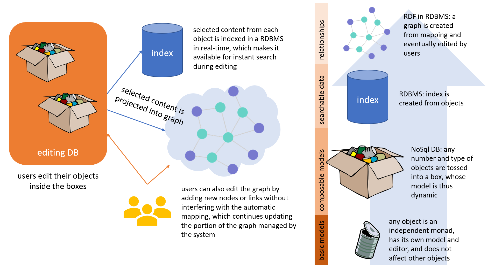

# Cadmus Graph

- [adapters](adapters.md)
- [mappings](mappings.md)
- [updating](updating.md)
- [database](database.md)

This library provides core components for mapping Cadmus data into RDF-like graphs.

The subsystem adds an RDF-based graph on top of the Cadmus database, integrating the edit experience so that graph nodes can be automatically created and kept in synch while editing parts, and at the same time users can add or link nodes in a visual UI, thus providing complex relationships across data at a higher abstraction level.

In a sense, just like you might be able to create a full-fledged TEI document without even knowing about XML, this subsystem allows you to create an RDF graph without even knowing about semantic web. In both cases you just edit data in GUIs; yet, the graph subsystem is not a later export, but a real-time mechanism for mapping Cadmus data models into nodes and triples, thus updating an existing graph whenever you save. Further, the graph subsystem also provides a new editing experience, where you can directly edit the graph by freely adding nodes or connecting them.

The graph is a complement to the Cadmus architecture, which must be opted in. Many projects can do without it; but the most complex ones will probably require it, especially when dealing with **relationships**.

Using a metaphor, the basic architecture includes objects of any type (parts), contained in a box (item) with an attached label (item's metadata); boxes are stored on shelves (the database infrastructure). In this architecture, it is essential that each object model is independent, as it is right this independency which allows its reuse in any other container.

So, in a sense our objects are _monadic_. Yet, we often need to represent relationships among them. While properties considered intrinsic or relevant to such objects are part of their model, relations with other objects are usually confined to the realm of incidental events.

Quoting a famous example used in [CIDOC-CRM](https://cidoc-crm.org/), consider the event of Caesar's murder by Brutus and others. In an event-centric ontology like CIDOC-CRM, we have 3 segments on the timeline of history, each corresponding to the lifespan of an entity: one for Caesar, one for Brutus, and one for the sword used by Brutus to stab him. The murder is the event which at a specific point in time (March 15, 44 BC) links all these 3 entities together: it's like drawing a vertical line which crosses all these segments, connecting them at some point in history.

Now, of course this event is something which is not intrinsically part of the description of a person like Caesar or Brutus, or of an object like a sword. It's an incidental event which happens to bind these entities at some point in time and space. Should we have a database of persons, or of archaeological artefacts, we could not make the sword a property of the person object, or vice-versa. These are not features considered intrinsic to either a person or an object in general terms (unless we are specifically collecting cases of murder). Adding such an optional property just to make room for that information somewhere would pollute the model of each object.

So, where should we place things like events or other types of less or more incidental relationships among various objects? Clearly, outside each of these types. Given that Cadmus is designed also for emitting RDF-like modeled data, thus allowing users to publish for the semantic web, it's obvious that such relations can easily be represented as edges connecting the nodes of a graph.

To this end, Cadmus has an additional layer of abstraction where we can put any of the objects edited in it, together with their relations and any other external object, e.g. imported from some LOD ontologies. This is the **graph**.

This does not mean that users necessarily have to edit data in terms of nodes and edges, which often is difficult for them. Most of the data for this graph can effectively be derived from our traditional monadic objects, to allow users continue work by focusing on an easily understandable mental model and its GUI.

In fact, many objects can legitimately include some relational data which fits their model and purpose. Some objects are even designed to contain purely relational data, e.g. when dealing with relationships like events. Among the general purpose parts, Cadmus provides a historical events model, which contains a list of events of any type, each with a description, optional date and/or time, and directly related entities. Such part can be used for a lot of different purposes: for instance, in the biography of a person it can represent all the relevant events involving that person, including birth and death.

So, users can encode a lot of relations without leaving the user-friendly environment of object-editing in a rich GUI. Whenever they save such objects, Cadmus can optionally apply a number of **mapping rules** for projecting a subset of their data into a RDF-like graph. This way, users effectively build RDF without even knowing about it, only by filling web forms; just like they can generate TEI without even knowing XML. All this is made possible by this projection mechanism, based on rules defined by the designers of each project, and stored in the Cadmus index database.

Yet, when required users can directly edit the graph, to supply additional nodes or edges. Their edits get combined with the result of projections, and are never overwritten by them, even though the projection can keep in synch its nodes and triples whenever items and parts are added, updated or deleted.

The following picture summarizes the different layers of abstraction used in Cadmus: from bottom to top, we start from the monadic objects; group them into boxes thus building models by dynamic composition; index a subset of their properties using data pins; and eventually project another subset via mapping into an editable graph.

The mappings are stored in the RDBMS index database, but for easier definition you can list them in a JSON file, and then let Cadmus tool import them.

At any rate, given that they are a completely independent resource, this means that you can not only change or augment the projection behavior at any time; but you could even design a totally different mapping, using different ontologies from the same set of data. In a sense, the graph here is just another output of our objects (except that users can eventually edit it directly for supplying new details).

So, at the hearth of the graph is the projection via mapping. The mapping flow includes these main steps:

(1) a **source object** is provided to the mapper. This can be any type, but the current implementation relies on objects serialized into JSON. Usually, these come from MongoDB directly, so JSON is already at hand. Source object are items or parts (thesauri can be imported as nodes, but this does not happen via mapping as it's a single procedure, whatever the thesaurus). At any rate, ultimately from the point of view of the mapper any source object is just JSON code representing it.

>Note: between the source object and the mappings there is an intermediate layer represented by [adapter components](adapters.md), whose task is adapting that object to the mappings and providing additional information from it.

(2) the mapper finds all the **[mappings](mappings.md)** matching the source object, and applies each of them, collecting the results (nodes and triples) into a graph set.

(3) the graph set is **[merged](updating.md)** into the graph store.
